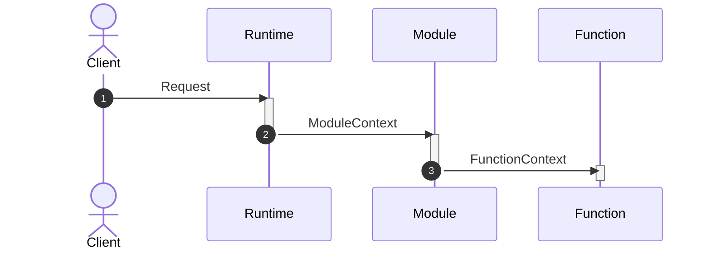

# Implementation

The implementation of a module is basically the union of the implementations of its functions
and the business logic to give them a context that satisfies their requirements. 

In Mondrian, a module is implemented by starting with its [definition](./01-definition.md) and 
invoking the `implement` method.

```ts showLineNumbers
import { result } from '@mondrian-framework/model'
import { module } from '@mondrian-framework/module'
import { postModuleDefinition } from './definitions'
import { 
  retrievePosts, 
  createPost, 
  updatePost, 
  deletePost 
} from '../post-functions'

const postModule = postModuleDefinition.implement({
  functions: {
    retrievePosts, 
    createPost, 
    updatePost, 
    deletePost 
  },
  context: async () => {
    return result.ok({ 
      // a context definition
    })
  },
})
```

## Context
Each function can require [a context](../function/02-implementation.md#context) it needs to fulfill its application logic. As an example a reference to a repository to interact with a data source, or a queue where to put some jobs to be completed. 

A module must provide a context that is the union of all the contexts required by all its functions. This constraint is enforced by the framework at typing level. The return type of the `contex` function that you must pass to implement a module is equal to the intersection between the types of the contexts required by each function.

Let's go with an example:
```ts showLineNumbers
// ...

type FirstFunctionContext = {
  repository: Respository
}
const firstFunction = fistFunctionDefinition.implement<FirstFunctionContext>({
  body: async ({ context }) => {
    // context is of type FirstFunctionContext
    // ...
  }
})

type SecondFunctionContext = {
  queue: Queue
}
const secondFunction = secondFunctionDefinition.implement<SecondFunctionContext>({
  body: async ({ context }) => {
    // context is of type SecondFunctionContext
    // ...
  }
})

const module = moduleDefinition.implement({
  functions: {
    firstFunction, 
    secondFunction
  },
  context: async () => {
    // must return an object of type FirstFunctionContext & SecondFunctionContext
    return result.ok({ 
      repository,
      queue
    })
  },
})
```

The output context is constructed by the module from an input that the module itself can declare, at the typing level, as the function's first parameter. It will then be the runtimes that execute this module that will have to worry about providing this input.

```ts showLineNumbers
...
const moduleImplementation = moduleDefinition
  .implement({
    // ...
    context: async (input: ContextInput) => {
      // use the input to build the context for the functions
      return result.ok({ 
        // a context definition
      })
    },
  })
```

That of context is thus a chain of processing in which each step fulfills its own responsibilities:

&nbsp;

- the **runtime** is responsible for interpreting the caller's request, since it knows its format, and extrapolating from it the data needed for the form, hiding all the technicalities of the execution environment.
- the **module** is responsible for processing these inputs from the runtime to create the context required by its functions
- the **function** uses the context to carry out its application logic

:::warning
Context creation is an operation that is **invoked at each function execution**; in fact, the module does not have its own permanent state. Therefore, care must be taken with this operation and the implications it may have on performance, connection management, etc.
:::

### Errors
Note that, as described in the [module definition](./01-definition.md), context creation can also return errors.

```ts showLineNumbers
// ...

const moduleDefinition = module
  .define({
    // ...
    // highlight-start
    errors: {
      invalidCredentials: model.string(),
      unauthorizedError: model.string()
    }
    // highlight-end
  })

const moduleImplementation = module
  .implement({
    // ...
    context: async ({ credentials } : { credentials: Credentials }) => {
      // highlight-start
      if(!credentials){
        return result.fail({ invalidCredentials: 'Given credentials are not valid' })
      }
      if(!isAuthorized(credentials)){
        return result.fail({ unauthorizedError: 'Unauthorized access' })
      }
      // highlight-end
      result.ok({
        // ...
      })
    }
  })
```


## Security Policies
The ability to serve APIs that can provide a portion of the domain graph makes the problem of securing data quite complex to manage. This is a typical issue in GraphQL contexts, but also quite common in general when the backend serves dynamic APIs that can satisfy complex data retrieval requests.

To solve this issue, Mondrian offers a ready-to-use security framework that allows you to define resource access policies in a simple but very powerful way.

```ts showLineNumbers
const moduleImplementation = moduleDefinition.implement({
  // ...
  policies(context) {
    if (context.userId != null) {
      return policies.loggedUser(context.userId)
    } else {
      return policies.guest
    }
  },
})
```

As you can see from the example, the `policies` function receives as input the module context and, based on it, returns a security policy that will then allow the framework to determine whether or not the call is authorized. Security policies are user-defined and determine what resources the caller may or may not access.

To explore this topic further you will find all the details in the section on [security policies](../../05-security.md).

## Options